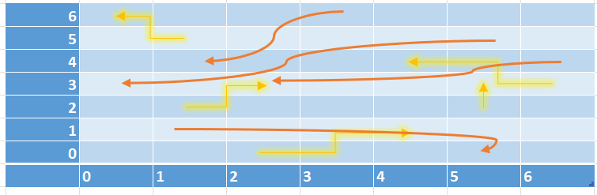

# Snakes&Ladders API
by Evyatar Bitton

### Assignment requirements
1. Your web API should expose the following:
    a. Add a new player:
        i. Trigger a background process that starts rolling the dice (1-6) and move the player across the board accordingly.
        ii. The player will continue to play automatically until the game ends (i.e. the user reached/exceeded the last tile).
    b. Get player status:
        i. Return the player status, which can be Unrecognized / During game / Finished.
        ii.Return the score (which is the total dice thrown count).
        iii. Return an indication if the player is ranked #1 in the total score board
2. Implementation:
    a. All data can be persisted in memory.
    b. The API should be exposed and consumed using Swagger
    c. The board data structure should be defined in the web server, implementation method is flexible. You can assume the it doesn’t change during a game.
    d. The board should contain ladders and snakes:
        i. When the player lands on a ladder’s bottom, he is transported to its top.
        ii. When the player lands on a snakes head, he is transported to its tail.
    e. Each game doesn’t affect other games (e.g. players can be on the same tile)
	
### Current Board Game

Row and Column numbering starts from 0 and goes up to 6 (including!) = final cell coordinates are {6,6}

### Other design notes:
1. Movement on Even rows is done from left to right. Movement on Odd rows is done from right to left.
2. When reaching the end of a row, taking one step up (this up movement costs a step!)
3. Board game is currently constant and is created in the Boardgame class. This may be modified in the future, for example to read these settings from a file

### Architecture:
Project is separated into four parts:
1. Controllers: Define the available REST API (only PlayerController for now).
2. Repositories: Access layer between the controller and the game logic. 
3. GameLogic: Data classes and the GameManager service that implement all the actual game logic.
4. Program&Startup files (usual ASP.Net core API files that setup the web api, Swagger and so on).